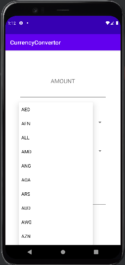
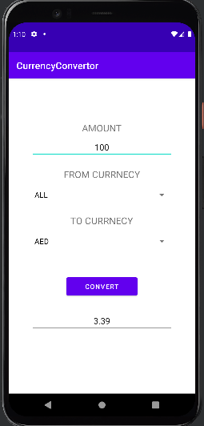
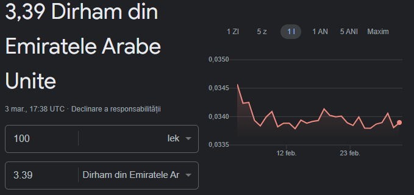

# CurrencyConvertor

This project has been implemented using Java in Android Studio. It is a Currency Converter tool that is powered by an API which retrieves up-to-date exchange rates for the currencies that the user desires to convert. The converter ensures accuracy and ease of use and has over 150 currencies available to choose from.

The API I used is [exchangerate.host](https://exchangerate.host/#/#docs)

## FUNCTIONALITIES:

- Add amount to convert
- Choose the currency you want to convert from
- Choose the currency you want to convert in
- Press CONVERT
- Conversion rate is displayed

## PREVIEW:

  

  

